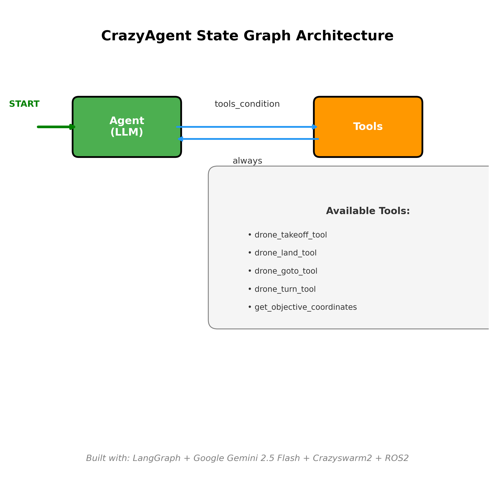

# 🤖 CrazyAgent

An intelligent AI agent that combines the power of Google's Gemini 2.5 Flash LLM with ROS2 and Crazyswarm2 to provide natural language control of Crazyflie nano-quadcopters. This project demonstrates the integration of modern AI language models with robotic control systems, enabling intuitive human-drone interaction through conversational interfaces.



## 🚁 About Crazyswarm2

**Crazyswarm2** is the next-generation ROS2-based framework for controlling swarms of Bitcraze Crazyflie quadcopters. As ROS1 reaches its end-of-life in 2025, Crazyswarm2 represents the future of Crazyflie swarm control for research and development.

### Key Features of Crazyswarm2:
- **ROS2 Native**: Built from the ground up for ROS2, ensuring compatibility with modern robotics ecosystems
- **Multi-UAV Support**: Designed for both single drone and swarm operations
- **Advanced Localization**: Supports LightHouse, LPS (Local Positioning System), and motion capture systems
- **Simulation Ready**: Integrated with simulators like Webots and Gazebo for development and testing
- **Research Focused**: Used in 50% of Crazyflie papers at recent ICRA and IROS conferences
- **Future-Proof**: Essential for post-2025 development as ROS1 support ends

### Why Crazyswarm2?
The transition from ROS1 to ROS2 is critical as ROS1 will no longer be supported on Ubuntu 22.04+ and will be completely phased out in 2025. Crazyswarm2 ensures that researchers and developers can continue their work with Crazyflie platforms in the modern ROS2 ecosystem.

## 🏗️ Architecture

CrazyAgent is built on a **LangGraph** state machine architecture that seamlessly integrates language understanding with drone control:

### Core Components:

1. **Agent Node (LLM)**: 
   - Powered by Google Gemini 2.5 Flash
   - Processes natural language commands
   - Decides when and which tools to use
   - Maintains conversation context

2. **Tool Node**: 
   - Executes drone control actions
   - Interfaces with ROS2 services
   - Provides feedback to the agent

3. **State Management**:
   - Maintains conversation history
   - Tracks agent state transitions
   - Handles error recovery

### Available Tools:

| Tool | Description | ROS2 Service | Parameters |
|------|-------------|--------------|------------|
| `drone_takeoff_tool` | Launch drone to 0.5m height | `/cf231/takeoff` | height, duration |
| `drone_land_tool` | Land drone safely | `/cf231/land` | height, duration |
| `drone_goto_tool` | Move to specific coordinates | `/cf231/go_to` | goal (x,y,z), yaw, relative |
| `drone_turn_tool` | Rotate by specified angle | `/cf231/go_to` | yaw (relative) |
| `get_objective_coordinates` | Convert objective names to coordinates | Local JSON lookup | objective |

## 🎯 Features

### Natural Language Control
- **Conversational Interface**: Control drones using natural language commands
- **Context Awareness**: Agent remembers previous commands and maintains conversation flow
- **Multi-Step Operations**: Can chain multiple actions based on complex instructions

### Objective-Based Navigation
- **Predefined Waypoints**: Navigate to labeled objectives (A, B, C, D)
- **Coordinate System**: Supports both absolute and relative positioning
- **Mission Planning**: Can interpret and execute multi-point flight plans

### Web Interface
- **Gradio UI**: Clean, intuitive web interface for interaction
- **Real-time Logging**: Comprehensive logging system for debugging and monitoring
- **Shareable Interface**: Can be deployed with public sharing enabled

### ROS2 Integration
- **Service-Based Architecture**: Uses ROS2 services for reliable drone communication
- **Namespace Support**: Configured for specific drone instances (cf231)
- **Error Handling**: Robust error handling and recovery mechanisms

## 🚀 Getting Started

### Prerequisites

1. **ROS2 Installation**: 
   - ROS2 Humble or newer
   - Properly sourced ROS2 environment

2. **Crazyswarm2 Setup**:
   ```bash
   # Install Crazyswarm2 (follow official documentation)
   # https://imrclab.github.io/crazyswarm2/
   ```

3. **Python Dependencies**:
   ```bash
   pip install -r requirements.txt
   ```

### Environment Setup

1. **Google API Configuration**:
   ```bash
   # Create .env file with your Google API key
   echo "GOOGLE_API_KEY=your_api_key_here" > .env
   ```

2. **Objective Map Configuration**:
   The agent uses predefined coordinates in `objective_map.json`:
   ```json
   {
       "A": [0.25, 0.25, 1.0],
       "B": [0.25, -0.25, 1.0], 
       "C": [-0.25, -0.25, 1.0],
       "D": [-0.25, 0.25, 1.0]
   }
   ```

### Running the Agent

1. **Start ROS2 and Crazyswarm2**:
   ```bash
   # In terminal 1: Start ROS2 core services
   ros2 launch crazyflie launch.py
   
   # In terminal 2: Start Crazyswarm2 server
   ros2 launch crazyflie_py crazyflie_server.py
   ```

2. **Launch CrazyAgent**:
   ```bash
   # Production mode
   ./run_crazy_agent.sh
   
   # Or simulation mode  
   ./sim_crazy_agent.sh
   
   # Or run directly
   python3 crazyAgent.py
   ```

3. **Access Web Interface**:
   - Open the provided URL in your browser
   - Start commanding your drone with natural language!

## 💬 Example Commands

### Basic Flight Operations
- "Launch the drone"
- "Take off and hover"
- "Land the drone safely"
- "Turn 90 degrees clockwise"

### Navigation Commands
- "Go to objective A"
- "Fly to coordinates [0.5, 0.5, 1.2]"
- "Navigate to point B then return to A"
- "Move to position [0, 0, 1.5] and turn around"

### Complex Missions
- "Take off, visit all objectives A through D, then land"
- "Perform a square pattern flight between the waypoints"
- "Fly to objective C, turn 180 degrees, then go to objective A"

## 📁 Project Structure

```
crazyAgent/
├── crazyAgent.py           # Main agent implementation
├── tools.py               # ROS2 drone control tools
├── retriever.py           # Objective coordinate lookup
├── requirements.txt       # Python dependencies
├── objective_map.json     # Predefined waypoint coordinates
├── run_crazy_agent.sh     # Production launch script
├── sim_crazy_agent.sh     # Simulation launch script
├── hello_folder/          # Example scripts and tutorials
├── readme_files/          # Documentation assets
└── logs/                  # Runtime logs and data
```

## 🔧 Configuration

### Drone Configuration
- **Namespace**: `/cf231` (configurable in tools.py)
- **Default Heights**: Takeoff (0.5m), Landing (0.04m)
- **Movement Duration**: 2.5 seconds per action
- **Coordinate System**: Standard ROS coordinates (x: forward, y: left, z: up)

### LLM Configuration
- **Model**: Google Gemini 2.5 Flash
- **Temperature**: 0.7 (balanced creativity/consistency)
- **Context Window**: Maintains conversation history
- **Tool Binding**: Automatic tool selection based on commands

## 📊 Logging and Debugging

The system provides comprehensive logging across multiple levels:

- **Agent Logs** (`crazyagent.log`): High-level agent decisions and flow
- **Tool Logs** (`tools.log`): Detailed ROS2 service interactions  
- **Console Output**: Real-time status and error messages
- **CSV Data**: Flight parameters and objective data for analysis

## 🧪 Development and Testing

### Hello Scripts
The `hello_folder/` contains example scripts for testing different components:
- `hello_crazyflie.py`: Basic Crazyflie ROS2 integration
- `hello_langgraph.py`: LangGraph framework examples
- `hello_TinyLlama.py`: Alternative LLM integration testing

### Simulation Mode
Use `sim_crazy_agent.sh` for testing without physical hardware. Ensure your Crazyswarm2 simulation environment is properly configured.

## 🤝 Contributing

This project represents the intersection of AI and robotics. Contributions are welcome in areas such as:
- Additional drone control capabilities
- Enhanced natural language understanding
- Swarm coordination features
- Alternative LLM integrations
- Simulation improvements

## 📚 Resources

- **Crazyswarm2 Documentation**: https://imrclab.github.io/crazyswarm2/
- **Crazyswarm2 GitHub**: https://github.com/IMRCLab/crazyswarm2
- **Bitcraze Crazyflie**: https://www.bitcraze.io/products/crazyflie-2-1/
- **LangGraph Documentation**: https://python.langchain.com/docs/langgraph
- **ROS2 Documentation**: https://docs.ros.org/en/humble/

## ⚠️ Safety Notice

Always follow proper safety protocols when operating drones:
- Ensure adequate space for flight operations
- Keep emergency stop procedures ready
- Test in simulation before hardware deployment
- Follow local aviation regulations
- Maintain visual line of sight with aircraft

## 📄 License

This project is open source. Please refer to the license file for specific terms and conditions.

---

*Built with ❤️ for the future of human-robot interaction*
